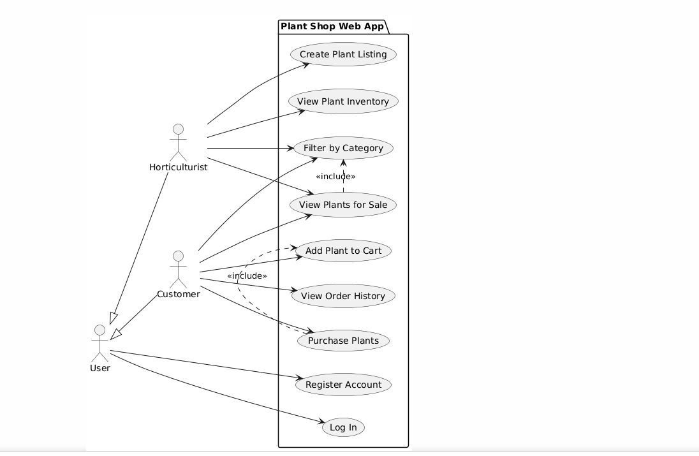
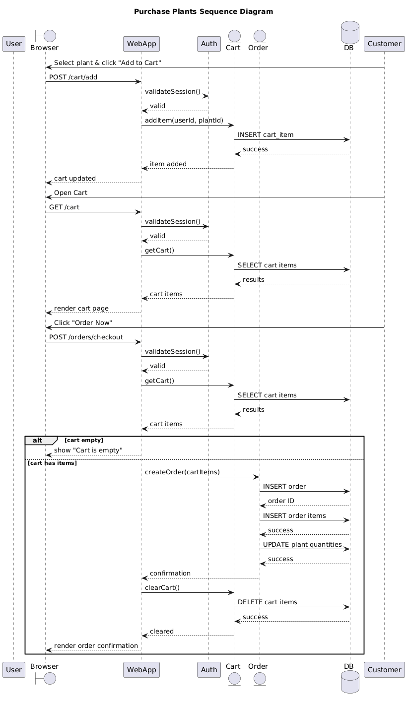
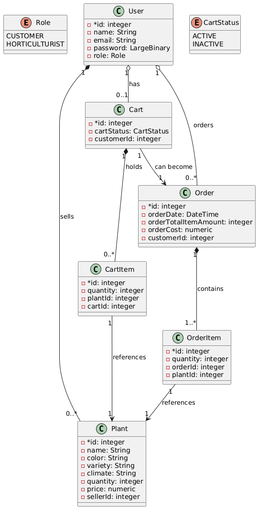
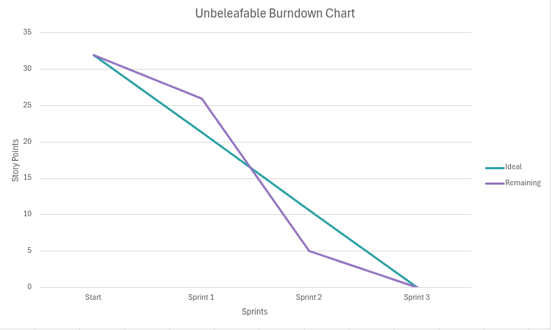

# Overview of Unbeleafable

The Unbeleafable Plant Shop is an online marketplace that connects horticulturists with customers who want to buy plants. Sellers can create listings, manage inventory, and track sales, while customers can browse plants, filter by category, make purchases, and view past orders. The system provides a simple, convenient interface for both buyers and growers, targeting local plant sellers and customers looking to build or expand their gardens.

---

# Design

---

## User Stories

This section describes the user stories identified for the project.

### User Story #1: User Registration

#### Allotted Story Points: 1

As a new user of the system, I want to register for the plant store platform by providing my name, a unique email address, a password, and my role as a horticulturist or customer so that I can either sell or buy plants based on my role. Given that I have supplied all of the required information in the sign-up page, when I hit the "Submit" button, then my account should be created and stored in the system.

### User Story #2: View Plant Inventory

#### Allotted Story Points: 2

As a logged-in horticulturist, I want to view all of the plants I have for sale and the plants my competitors have for sale so that I can evaluate the market, update my plant listings, and sell plants I have grown at a competitive price all in one interface. Given that I am logged in, when the plant dashboard loads, then I can see all of the plants available for sale organized in a convenient format.

### User Story #3: New Plants for Sale

#### Allotted Story Points: 3

As a logged-in horticulturist, I want to create a plant listing with information about the plant's name, color, variety, quantity, required climate, and price, so that I can publish a plant listing and sell it to customers. Given that I am logged in and have entered the required plant information, when I hit the "List" button, then the plant is saved into the system and can be purchased by customers.

### User Story #4: View Plants for Sale

#### Allotted Story Points: 8

As a customer, I want to view all the plants for sale at the same time or by a specific category so that I can purchase plants and start a garden. Given that I am logged in and on the sale page, when I select the category of plants I want to look at and click the category I want, then a list of plants for sale will be displayed based on the selected category.

### User Story #5: Purchase Plants

#### Allotted Story Points: 13

As a customer, I want to add plants to my cart and purchase them so I can start my garden. Given that I am logged in, the plant being selected is in stock, the plant has been added to my cart, and I am viewing my cart page, when the button "Order Now" has been clicked, then I have purchased the plants and the system records the purchase.

### User Story #6: View Plant Invoice

#### Allotted Story Points: 5

As a customer, I want to view my previous plant orders so that I can keep track of what types of plants I have purchased. Given that I am logged in and have made a purchase, when I select the "view recent orders" page, then I can view a list of all my orders organized by order date.

---

## Sequence Diagram

### User Story Five Sequence Diagram

---

## Class Model Diagram

---

# Development Process

This section should describe, in general terms, how Scrum was applied in the project. Include a table summarizing the division of the project into sprints, the **user story** goals planned for each sprint, the ones actually completed, and the start and end dates of each sprint. You may also add any relevant observations or reflections about the sprints as you see fit.

| Sprint# | Goals            | Start    | End      | Done             | Observations                                                                                                                                                                                                                                                                                                                                                                                                          |
| ------- | ---------------- | -------- | -------- | ---------------- | --------------------------------------------------------------------------------------------------------------------------------------------------------------------------------------------------------------------------------------------------------------------------------------------------------------------------------------------------------------------------------------------------------------------- |
| 1       | US#1, US#2, US#3 | 11/19/25 | 11/25/25 | US#1, US#2, US#3 | It was tedious for the group to plan the whole project,  refine all the user stories, and build the project files from the ground up. Although everything was completed in time, it was difficult to focus on design and  implementation at the same time.                                                                                                             |
| 2       | US#4, US#5       | 11/25/25 | 12/2/25  | US#4, US#5       | User story four was relatively simple to implement while user story five took up most of this sprint. Some design adjustments were made to better align with the implementation of the user stories. This sprint was considered  difficult because implementing  user story five proved to be a complex task and project work had to be coordinated over a break. |
| 3       |                  |          |          |                  |                                                                                                                                                                                                                                                                                                                                                                                                                       |

As in Project 2, you should take notes on the major Scrum meetings: planning, daily scrums, review, and retrospective. These meetings are essential for tracking progress, identifying obstacles, and ensuring continuous improvement. Use the Scrum folder and the shared templates to record your notes in an organized and consistent manner.

Embed an image of the burndown chart here.

---

# Testing

In this section, share the results of the tests performed to verify the quality of the developed product, including the test coverage relative to the written code. Test coverage indicates how much of your code is exercised by tests, helping assess reliability. There is no minimum coverage requirement, but ensure there is at least some coverage through one white-box test (which examines internal logic and structure) and one black-box test (which validates functionality from the user’s perspective).

### Black Box Testing Results

For black-box testing, we implemented an automated Selenium test that exercised functionality exactly how a real user would, without referencing internal code or database logic.

**Tested User Story:**
As a visitor, I want to see a clear welcome message and navigation options on the home page so I know what the site is and how to log in or sign up.

**Test Name:**
`test_blackbox_homepage`

**Method:**

- Opened the public home page (`/`) in headless Chrome via Selenium WebDriver.
- Verified visible UI elements including `<h1>` site title, welcome message text, and expected navigation links for non-authenticated visitors.

**Expected Results:**

- Page title: **“Unbeleafable Plant Shop”**
- Welcome message visible (`"Welcome to your one-stop plant shop!"`)
- Navigation options: **Home**, **Login**, **Sign Up**

**Actual Results:**
✔️ **Passed** — Selenium confirmed that expected UI elements appear correctly and the system responds with the appropriate public navigation state.
This confirms that the core landing page experience behaves correctly from the perspective of an anonymous, external user.

---

### White Box Testing Results

White-box testing for this project focused on validating the internal logic and data handling of the application rather than just the visible user interface. Instead of treating the system as a black box, we used our knowledge of the routes, models, and conditional logic in the code to design targeted tests and confirm that the implementation behaved as intended.

**Inventory Filtering (Quantity > 0)**One of the key business rules in the system is that customers should only be able to see and purchase plants that are actually in stock. We reviewed the query logic used to populate the customer plant listings and confirmed that it filters out plants whose quantity is 0. To validate this behavior, we:

- Manually created two plant records as a horticulturist:
  - Plant A with a positive quantity (e.g., 5)
  - Plant B with quantity set to 0
- Logged in as a customer and opened the plant listings page.
- Verified that Plant A appeared in the listings while Plant B did not.

Because we designed this test based on the known implementation detail (the quantity filter in the backend query), this is considered white-box testing. It confirms that the internal rule for hiding out-of-stock plants is enforced correctly in the customer view.

**Role-Based Navigation and Dashboards**We also applied white-box testing to verify the conditional navigation and dashboard rendering based on user roles defined in the code. The `base.html` template and route handlers use the authenticated user’s role (horticulturist vs. customer) to decide which links and pages are shown. Using this knowledge, we tested the following:

- Created a horticulturist account and logged in to confirm that:
  - The navigation bar displayed **My Dashboard** and **Create Plant**.
  - The horticulturist dashboard correctly listed that user’s plant inventory.
- Created a customer account and logged in to confirm that:
  - The navigation bar displayed **Plant Listings**, **My Cart**, and **My Orders**.
  - The customer view did not expose seller-only actions such as creating plants.

These tests relied on understanding how `current_user.role` is checked in the templates and routes. By combining code inspection with targeted manual interaction, we confirmed that role-based access and navigation are implemented correctly and that users only see features appropriate to their role.

---

### Test Coverage Results

Although no minimum coverage requirement was specified, our automated testing achieved coverage in two critical dimensions:

- **Black-box coverage:** validated public UI functionality and anonymous navigation
- **White-box coverage:** validated backend logic for inventory filtering and authenticated user navigation

Current automated test coverage exercises:

- Public landing page rendering
- Navbar conditional logic based on user authentication

### Manual Testing Results

| User Story | Feature/Function                   | Test Format   | Date     | Time  | Result |
| ---------- | ---------------------------------- | ------------- | -------- | ----- | ------ |
| 1          | User Registration (Horticulturist) | Manual/Docker | 11/24/25 | 19:20 | Passed |
| 1          | User Registration (Customer)       | Manual/Docker | 11/24/25 | 19:25 | Passed |
| 2          | View Plant Inventory               | Manual/Docker | 11/24/25 | 19:22 | Passed |
| 3          | Create Plant/New Plants for Sale   | Manual/Docker | 11/24/25 | 19:23 | Passed |
|            |                                    |               |          |       |        |
|            |                                    |               |          |       |        |
|            |                                    |               |          |       |        |
|            |                                    |               |          |       |        |
|            |                                    |               |          |       |        |
