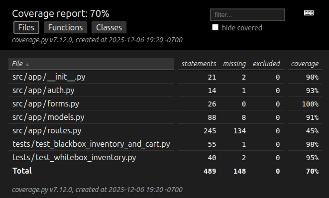

# Overview of Unbeleafable

The Unbeleafable Plant Shop is an online marketplace that was designed to connect local horticulturists with customers who want to buy plants through a simple platform. Sellers can create listings, manage inventory, and track sales, while customers can browse plants, filter by category, make purchases, and view past orders. The system provides a straightforward, convenient interface for both buyers and growers, empowering local plant sellers and customers who are looking to build or expand their gardens.

## Use Case Diagram of Unbeleafable

# Design

## User Stories

This section describes the crucial user stories identified for the Unbeleafable project.

### User Story #1: User Registration

---

#### Allotted Story Points: 1

As a new user of the system, I want to register for the plant store platform by providing my name, a unique email address, a password, and my role as a horticulturist or customer so that I can either sell or buy plants based on my role.

Given that I have supplied all of the required information in the sign-up page, when I hit the "Submit" button, then my account should be created and stored in the system.

### User Story #2: View Plant Inventory

---

#### Allotted Story Points: 2

As a logged-in horticulturist, I want to view all of the plants I have that are for sale or are out of stock, and the plants my competitors have for sale so that I can evaluate the market, update my plant listings, and sell plants I have grown at a competitive price all in one interface.

Given that I am logged in, when the plant dashboard loads, then I can see all of the plants stored in the system that are available for sale organized in a convenient format.

### User Story #3: New Plants for Sale

---

#### Allotted Story Points: 3

As a logged-in horticulturist, I want to create a plant listing with information about the plant's name, color, variety, quantity, required climate, and price, so that I can publish a plant listing and sell it to customers.

Given that I am logged in and have entered the required plant information, when I hit the "List" button, then the plant listing is saved in the system.

### User Story #4: View Plants for Sale

---

#### Allotted Story Points: 8

As a logged-in customer, I want to view all the plants for sale at once or by a specific category so that I can purchase plants and start a garden.

Given that I am logged in and on the "Plant Listings" page, when I first load the webpage, then I see a list of all plants currently for sale in the system.

Given that I am logged in and on the "Plant Listings" page, when I select the category/categories of plants I want to look at and click the "Browse" button, then a list of plants for sale in the system will be displayed based on the selected category/categories.

### User Story #5: Purchase Plants

---

#### Allotted Story Points: 13

As a logged-in customer, I want to add plants to my cart and purchase them so I can start my garden.

Given that I am logged in and the plant(s) being selected are in stock, when the "Add to Cart" button has been clicked, then the plant has been added to my cart and I can view it in the "My Cart" page.

Given that I am logged in and the plants in my cart are in stock, when the "Order Now" button has been clicked, then I have purchased the plants and the system records the purchase.

### User Story #6: View Plant Invoice

---

#### Allotted Story Points: 5

As a logged-in customer, I want to view my previous plant orders so that I can keep track of what types of plants I have purchased.

Given that I am logged in and have made a purchase, when I select the "My Orders" page, then I can view a list of all my previous orders organized by order date.

## Sequence Diagram

### User Story Five Sequence Diagram

## Class Model Diagram

# Development Process

### Development Summary Table

The table included is a summary of all the sprints conducted to build Unbeleafable. The observations for each sprint outline the outcome of the sprint and the difficulties that were overcome. To view more information about the team's agile workflow, view the contents of the [Scrum folder](scrum/). It contains the product backlog, the burndown chart, and all of the notes taken during sprint daily stand-ups, planning, review, and retrospective meetings. 

| Sprint# | Goals            | Start    | End      | Done             | Observations                                                                                                                                                                                                                                                                                                                                                                     |
| ------- | ---------------- | -------- | -------- | ---------------- | -------------------------------------------------------------------------------------------------------------------------------------------------------------------------------------------------------------------------------------------------------------------------------------------------------------------------------------------------------------------------------- |
| 1       | US#1, US#2, US#3 | 11/19/25 | 11/25/25 | US#1, US#2, US#3 | It was tedious for the group to plan the whole project, refine all the user stories, and build the project files from the ground up. Although everything was completed in time, it was difficult to focus on design and implementation at the same time.                                                                                                                       |
| 2       | US#4, US#5       | 11/25/25 | 12/02/25 | US#4, US#5       | User story four was quicker to implement than expected while user story five took up most of this sprint. Some design adjustments were made to better align with the implementation of the user stories. This sprint was considered difficult because implementing user story five proved to be a complex task. Furthermore, it was tough to coordinate project work over break. |
| 3       | US#6             | 12/02/25 | 12/06/25 | US#6             | Implementing the last user story was a relatively smooth process. Since Docker deployment was continuously tested, deploying the entire project with Docker went well. The most challenging part of this sprint was polishing up the notes, README, and the code to ensure readability and compliancy with PEP-8.                                                                |

### Burndown Chart

The image below depicts the burndown chart generated from each sprint's progress. The "Ideal" column shows the ideal story points remaining after each sprint. For this project, the ideal remaining values were calculated using a constant rate of approximately 10.67.

# Testing

## Black Box Testing Results

Black-box testing evaluates functionality from the user’s perspective without relying on knowledge of internal implementation details. The following test interacts only through route requests and rendered HTML output, without calling internal helper functions.

### Test Name

`test_blackbox_inventory_and_cart`

### Purpose

To verify that customers only interact with valid inventory and that cart operations behave correctly through normal HTTP usage.

### Method

* Uses Flask’s built-in test client to simulate a logged-in customer.
* Sends real GET and POST requests to application routes such as:
  * `/buyplants`
  * `/mycart/add`
  * `/mycart`

### Assertions

✔ **Only plants with `quantity > 0` appear** on the customer dashboard.

✔ A customer may **add an in-stock plant to their cart** using `/mycart/add`.

✔ The **cart page displays correct name, quantity, and total cost** after the item is added.

### Behavior Verified

* Out-of-stock plants (`quantity == 0`) are never listed for purchase.
* Normal cart flow functions correctly with valid inventory.

## White Box Testing Results

White-box testing examines internal implementation details and tests logic directly based on knowledge of the code structure. The following test inspects returned values from the application’s internal code path rather than the UI.

### Test Name

`test_whitebox_inventory`

### Purpose

To verify that the backend function responsible for listing plants correctly filters out plants with zero quantity before sending results to any UI layer.

### Method

* Calls the internal helper function `get_all_plant_listings()` directly.
* Creates a controlled test database with three plants:
  * Two in-stock plants (`quantity > 0`)
  * One out-of-stock plant (`quantity == 0`)

### Assertions

✔ Returned listings contain **only plants where `quantity > 0`**

✔ IDs of in-stock plants appear in the result set

✔ ID of the out-of-stock plant **does not** appear in the result set

## Test Coverage Results

Coverage was generated using Python’s `coverage` tool.

### Commands Used

`coverage run -m unittest discover tests`

`coverage html`

This creates the `htmlcov/` directory, including an `index.html` file that shows line-by-line coverage information.

### Coverage Highlights

* Internal inventory filtering logic exercised.
* Customer dashboard and cart flow executed through route calls.
* Both tests covered 70% of the codebase.

Together, these tests provide both:

* **White-box coverage** of core business logic.
* **Black-box coverage** of user-facing shopping functionality.

## Manual Testing Results

| User Story | Feature/Function                   | Test Format   | Date     | Time  | Result |
| ---------- | ---------------------------------- | ------------- | -------- | ----- | ------ |
| 1          | User Registration (Horticulturist) | Manual/Docker | 11/24/25 | 19:20 | Passed |
| 1          | User Registration (Customer)       | Manual/Docker | 11/24/25 | 19:25 | Passed |
| 2          | View Plant Inventory               | Manual/Docker | 11/24/25 | 19:22 | Passed |
| 3          | Create Plant/New Plants for Sale   | Manual/Docker | 11/24/25 | 19:23 | Passed |
| 4          | View Plants by Category            | Manual/Docker | 11/28/25 | 13:20 | Passed |
| 5          | Add to Cart and Submit Order       | Manual/Docker | 12/01/25 | 15:23 | Passed |
| 6          | View Orders and Items Ordered      | Manual/Docker | 12/04/25 | 13:55 | Passed |
